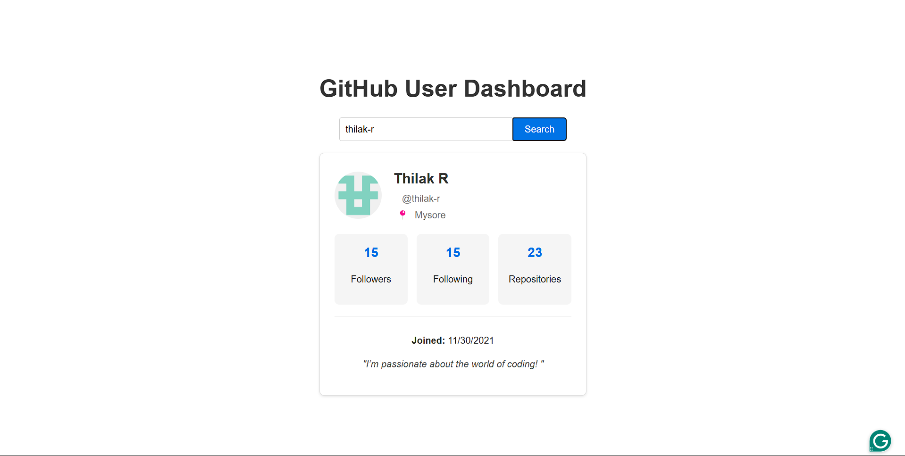

# GitHub User Insights Dashboard 🌟

[](https://react.dev/)
[](https://vitejs.dev/)
[](https://docs.github.com/en/rest)
[](https://developer.mozilla.org/en-US/docs/Web/CSS)

A simple React application to explore GitHub user profiles and statistics using the GitHub API.

 <!-- Add screenshot later -->

visit the react-app: [git-dashboard](https://bhuvan-s-prasad.github.io/react-git-dashboard/)

## Features ✨

- 🔍 Search GitHub users by username
- 📊 View user statistics (followers, following, repositories)
- 🖼️ Display user profile information including bio and social links
- 📅 Show account creation date
- 🌐 Responsive design for all screen sizes

## Getting Started 🚀

### Prerequisites
- Node.js (v16 or higher)
- npm (v9 or higher)

### Installation

1. Clone the repository:
   
   ```bash
   git clone https://github.com/your-username/github-user-dashboard.git
   ```
   
2. Navigate to the project directory:
   
   ```bash
   cd github-user-dashboard
   ```

3. Install dependencies:

   ```bash
   npm install
   ```

4. Start the development server:

   ```bash
   npm run dev
   ```

5. Open your browser and visit:

   ```bash
   http://localhost:5173
   ```

## How to Use 🔎

1. Enter a GitHub username in the search bar.
2. Click the "Search" button to:
   - View profile picture and basic information
   - See account statistics (followers, following, repositories)
   - Check social media links (if available)
   - Read the user bio (if provided)
   - See account creation date

## Technologies Used 💻

- **React**: JavaScript library for building user interfaces
- **Vite**: Quick development build tool
- **GitHub API**: For fetching user data
- **CSS**: Styling and layout

## Project Structure 📁

```
github-user-dashboard/
├── public/           # Static assets and images
│   ├── components/   # React components (e.g., UserProfile.jsx)
│   ├── App.jsx       # Main application logic
│   ├── App.css       # Main stylesheet
│   └── main.jsx      # Application entry point
├── package.json      # Project dependencies and scripts
└── README.md         # Project documentation
```

## Learning Outcomes 🎓

This project helped me learn:
- React basics, including component architecture, JSX, and props
- React state management with `useState`
- API fetching using async/await
- Component-based application design and reusability
- Error handling during API calls
- Responsive CSS styling and layout
- Integrating with the GitHub API to retrieve data

## Future Improvements 🚧

- Display user repositories with clickable links.
- Add dark/light theme toggle.
- Implement search history.
- Enhance loading animations.


